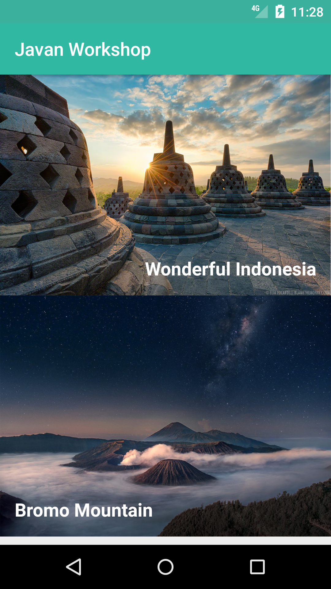

# Javan Android Workshop

> Choose a job you love and you will never have to work a day of your life.

—Confucius

## TextView dan ImageView



### Programmatically

#### TextView

```java
TextView tvBromo = (TextView) findViewById(R.id.tv_bromo);
tvBromo.setText("Bromo Mountain");
```

#### ImageView

```java
ImageView imgBromo = (ImageView) findViewById(R.id.img_bromo);
imgBromo.setImageResource(R.drawable.bromo_milky_way);
imgBromo.setAdjustViewBounds(true);
imgBromo.setScaleType(ImageView.ScaleType.FIT_START);
```
