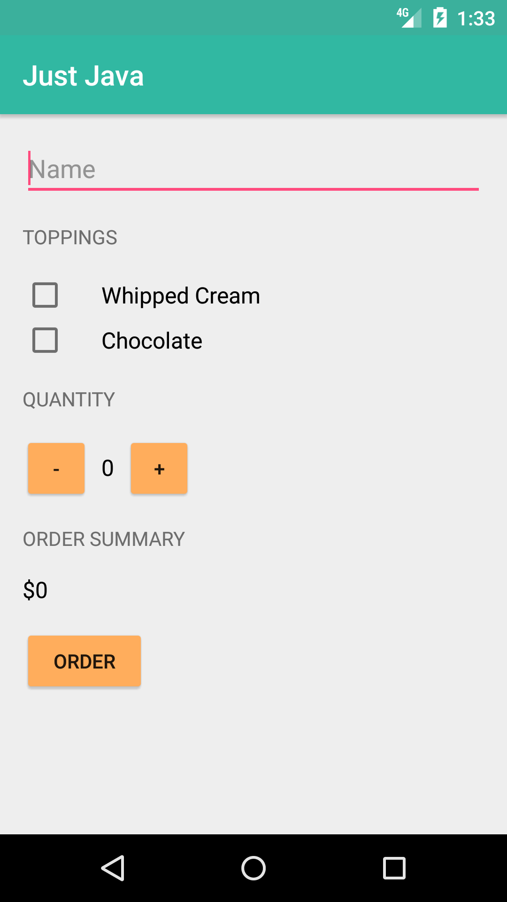

# Javan Android Workshop

> Choose a job you love and you will never have to work a day of your life.

—Confucius

## Court Counter

From lesson 7 on [Android Development For Beginner][udacity_link]

## Previous

1. [TextView and ImageView][learn_1]
2. [Birthday Card][learn_2]
3. [Just Java][learn_3]

[udacity_link]: https://www.udacity.com/course/android-development-for-beginners--ud837
[learn_1]: https://github.com/ramadani/JavanAndroidWorkshop/tree/text-image-view
[learn_2]: https://github.com/ramadani/JavanAndroidWorkshop/tree/birthday-card
[learn_3]: https://github.com/ramadani/JavanAndroidWorkshop/tree/3-just-java
